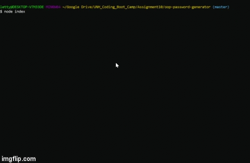

# oop-password-generator
Assignment 10 - OOP Password Generator

## Assignment Description

Refactor your previous password generator assignment to be a Command Line Interface (CLI) using Node, Inquirer, and ES6 Classes.

Your application should prompt a user for their desired password length and character options. 

Your CLI should _not_ have procedural code, or code that is not a method on a class.

## Links

[github source](https://github.com/yttel/oop-password-generator)

[Use example (YouTube)](https://youtu.be/YaQdSUV7ft4)

## Use Example

## Known Issues

1. If initial input for the length is invalid (via inquirer validation) there is no way to enter valid length. Appears to concat subsequent entries to original.

* Fix - down arrow will clear previous entry.

2. If validation is turned off and a string instead of a number is entered, upon hitting enter the string is changed to "NaN" (some kind of internal validation for the "number" type?). Does not error out or stop processing, returns password with no length.
